# aqua_man
## Introduction
I want to implement a system to messure the current waterlevel of a watertank with the help of a ultrasonic sensor. I want to integrate the sensor into the local home assistant network with the help of esphome.

## Initial Situation
There are to large watertanks with a total volume of 2000 liters installed half way up the mountain for a fresh water supply. From there we supply all the facilities of the FabFarm. The watertanks are connect to the waterpump thats installed in the valley of the farm. The waterpump is already integrated into the home assistant network through a relay thats connected to a microcontroller.

<p align="center">
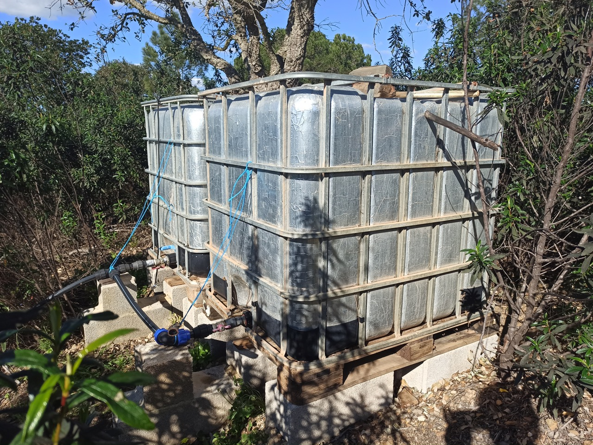
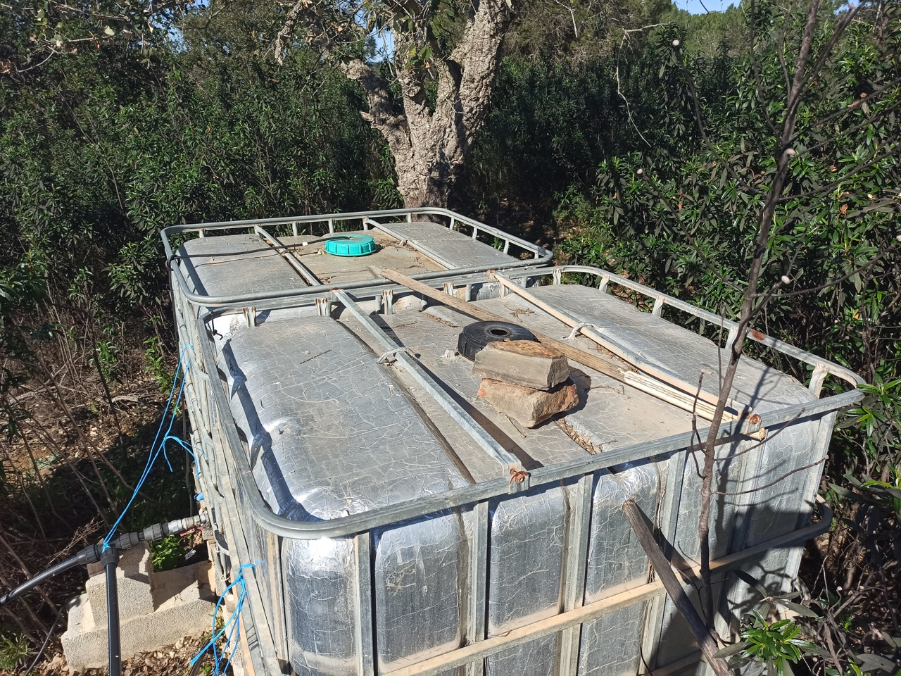 
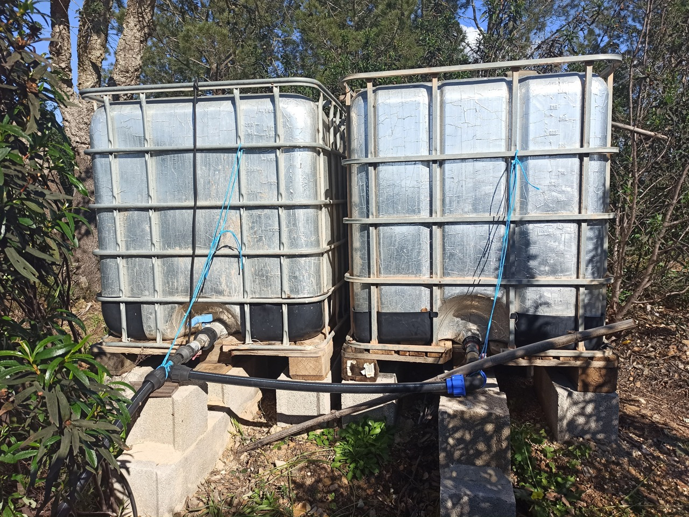
</p>

## Goal and Requirments

The goal is to monitor the waterlevel, transmit the data to the local home assistant server and implement an automation based on the datastream. Based on local circumstances and some research, I came up with the following requirments:

The System must
  1) include a self-sufficient energy supply
  2) communicate through WI-FI and Network with local home assistant server
  3) store excessiv energy
  4) work highly efficent
  5) withstand all weather conditions
  6) resistant to extreme heat and sun.

## Design

Based on the requirments I came up with the following compontants:

### ESP01

<p align="center">

</p>

The ESP01  is a type of low-cost Wi-Fi microcontroller module.  It is based on the ESP8266 chip and is small in size, making it a good choice for this project. Furthermore is works on 3.3 V and need only little power. [(Datasheet)](/datasheets/ESP01.PDF)

### ESP01 Programmer

<p align="center">
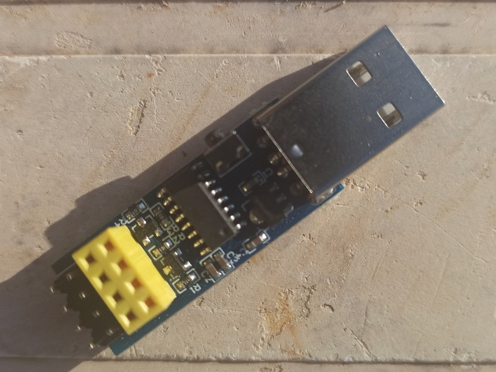
</p>

An ESP01 programmer is a device used to program the ESP01 module,It acts as a bridge between a computer and the ESP01 module, allowing you to upload your code to the module, as well as perform other tasks such as setting its parameters or reading its data. DIY solutions available.

### Grove - Ultrasonic Ranger V2.0

<p align="center">
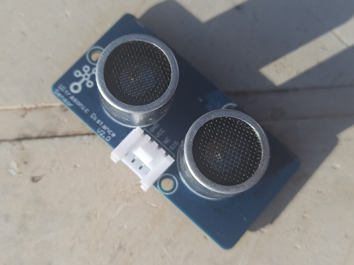
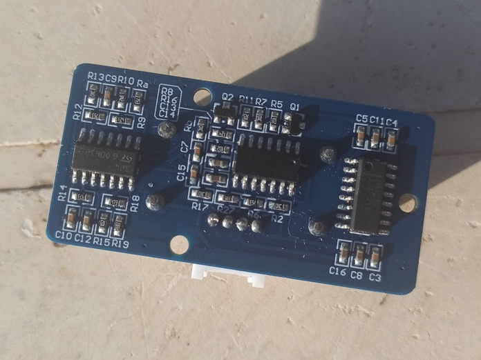
</p>

This Sensor uses ultrasound to mesure the distance to an object or surface. Unlike the well known HC-SR04 sensor this one works with 3.3 V and trig and echo signal share 1 SIG pin. Therefore it can share the same power supply then the ESP.
[(Website)](https://wiki.seeedstudio.com/Grove-Ultrasonic_Ranger/)


- Operating Voltage: 3.2 ~ 4.2V
- Operating Current: 8mA
- Measuring range: 2 - 350cm
- Resolution: 1cm

### TP4056

<p align="center">
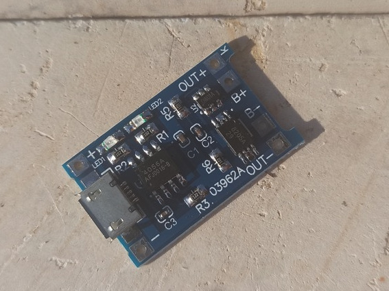
</p>

Linear Li-Ion battery charger IC with a constant-current and constant-voltage charging algorithm, thermal regulation, and charge status indication. It can work with USB or a supply of up to 8 V. Charging current is programmable with resistor. [(Datasheet)](/datasheets/ESP01.PDF)

- Programmable Charge Current Up to 1000mA
- Input Supply Voltage：4Vmin, 5Vtyp, 8Vmax
- Charging current from 130mA to 1A
- Upper charge stop voltage : 4.2V.

### Solar Panel

<p align="center">
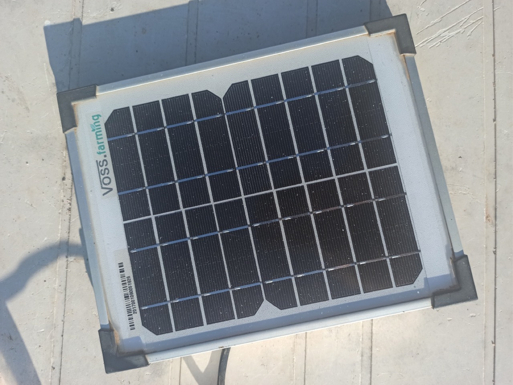
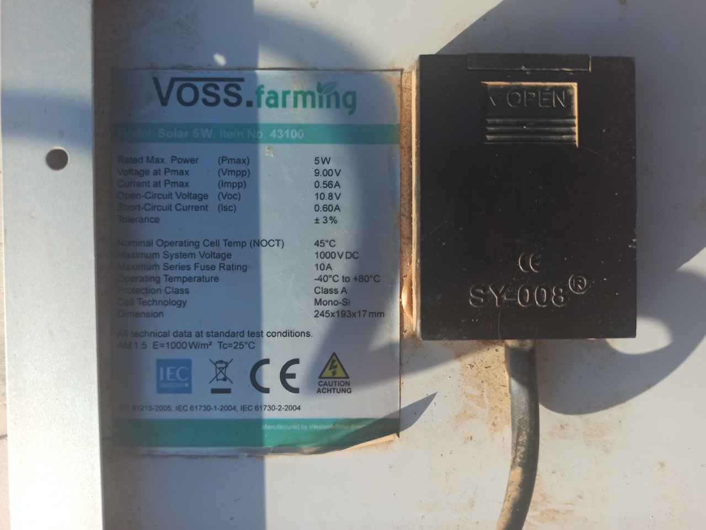
</p>

This Solar Panel will generate the needed energy for the system and will charge the battery up for periods of missing sun.

- Pmax: 5W
- V at Pmax: 9V
- Current at Pmax: 560mA

### Other Compontents

- **Waterproof Container**: A plastik box or simlar. I used an cleaned up plastik jar. SHould be large enough to contain all the components mounted on the wooden board.
- **Wooden Board**: Should have enough surface for all the compontents and bettery cell.
- **Cable**
- **Glue**: To fix the wooden board to the container 
- **Soldering iron plus accessories**
- **Drill, screwdriver and screws**: To mount the compontents and drill the hole for the ultrasonic sensor


## Hardware Design

I used a little wooden board as the mount for the components. I used With glue I connected the board to the plastic jar, which works as awater proof container. 

### Circuit Design

<p align="center">
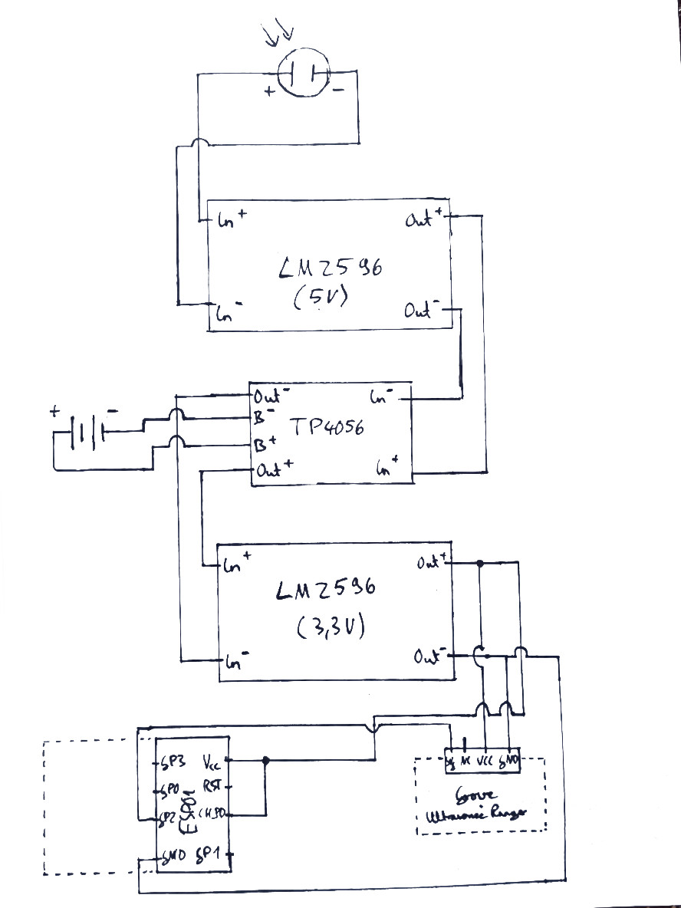
</p>

### Instructions

<p align="center">
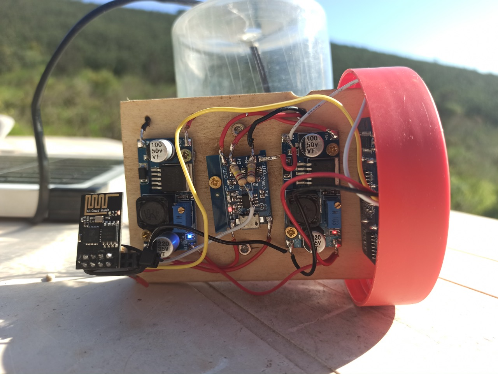
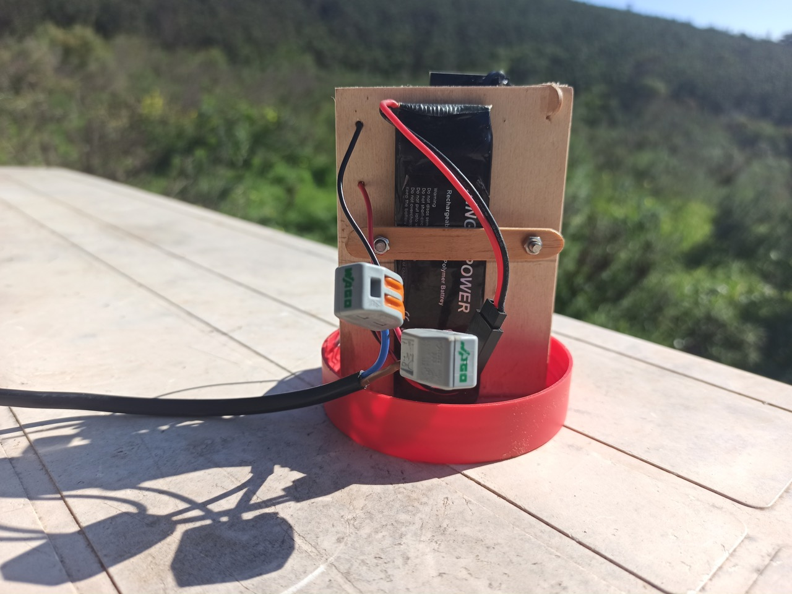
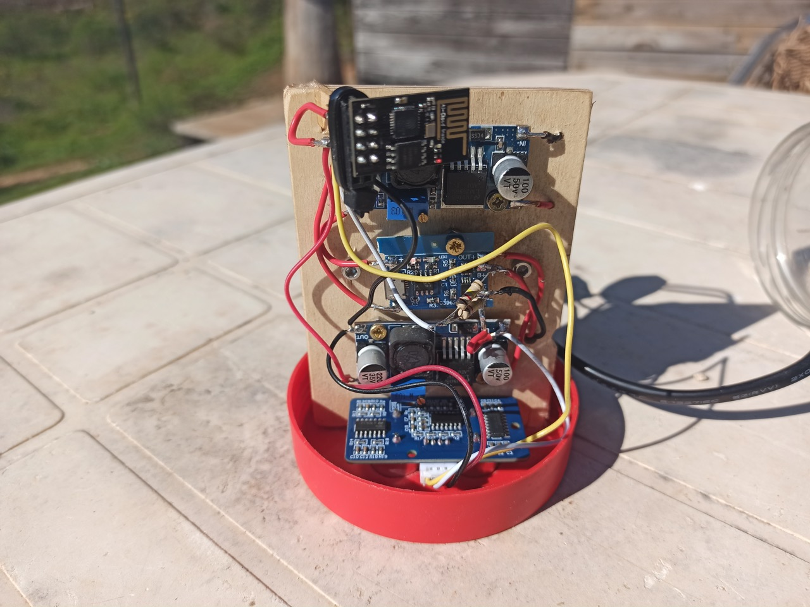
</p>

<p align="center">
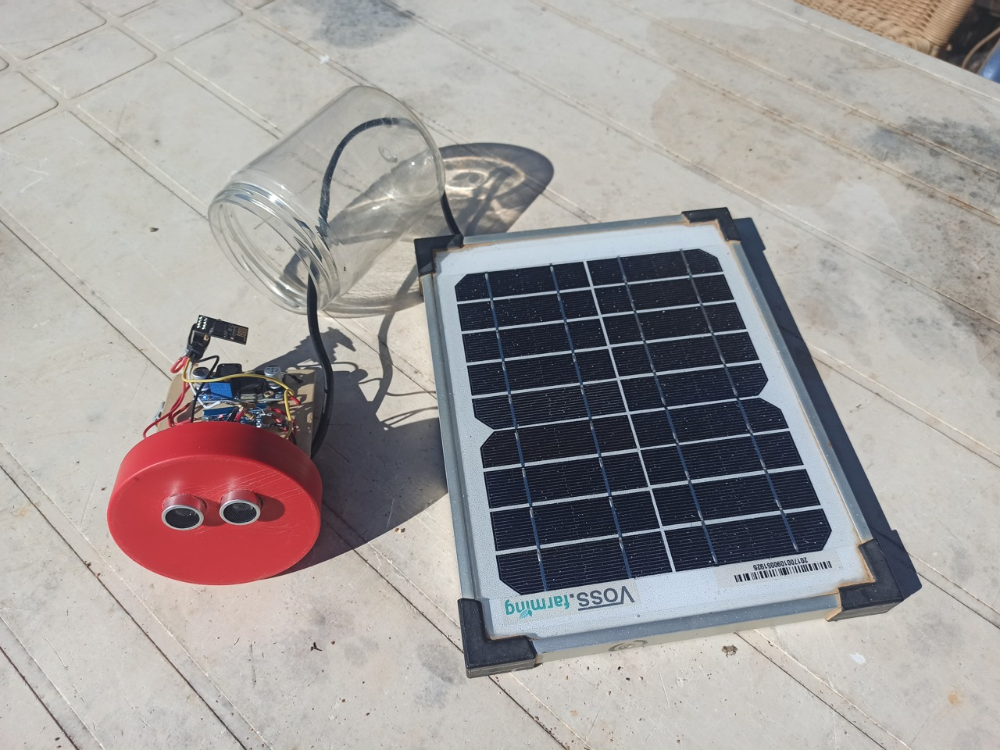
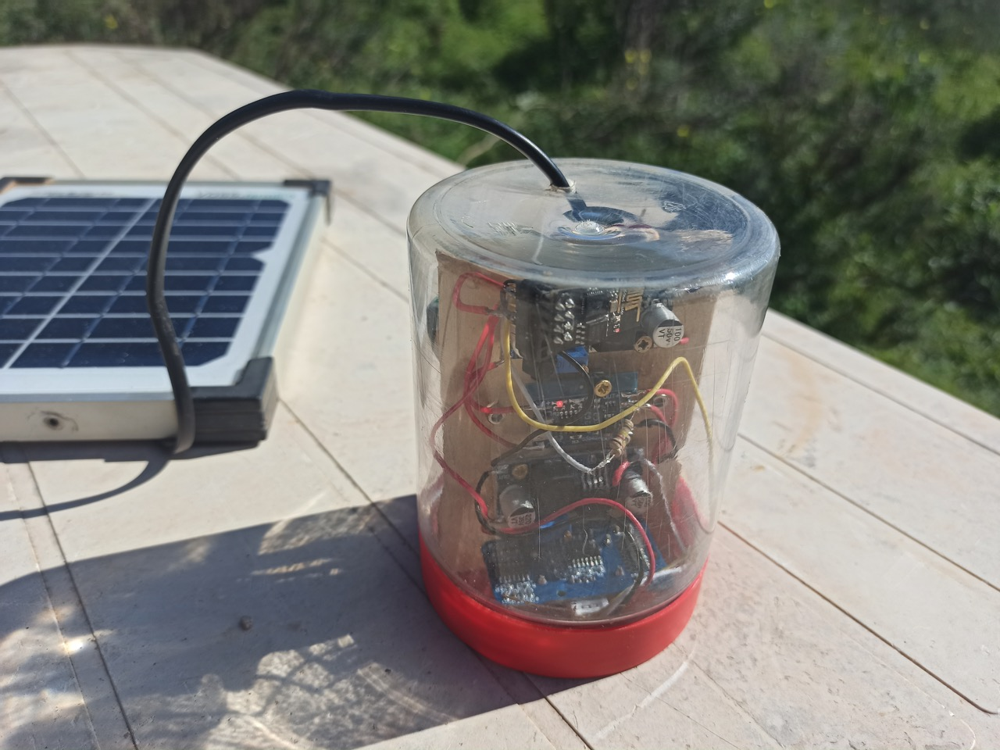

</p>

1) Cut out the wooden plate fitting height and diameter of the plastic jar.
2) Essamble the components on the wooden plate. Use the circuit diagram for arragment. Use a header pin strip for mounting the ESP to the circuit. Thereby the ESP can later be programmed with the ESP Programmer.
3) Find a suitable spot for the battery based on the design. 
4) Drill two holes for reciever and transmitter of the ultrasonic sensor.
5) Solder the components based on the circuit diagram.
6) Use glue to attach the wooden plate to the lid of the plastic jar.
7) Drill a hole and pass through the cable for the solar panel.

## Software Design

This Documentation does not cover the setup of home assisant, which is a open-source platform for automating smart home devices and building custom solutions for home automation. I use ESPHome, which is an open-source platform for creating custom firmware for ESP8266 and ESP32-based devices for use with Home Assistant. It uses YAML configuration files for defining the device's behavior and automations. It is possible to run ESPHome standalone for development purpose. I used Docker for setting up ESPHome on my machine to not 
accidentally destroy the local Home Assistant Server.

### Environment (Docker with ESPHome)

Follow along with the officale [*Getting Started with the ESPHome Command Line*](https://esphome.io/guides/getting_started_command_line.html#getting-started-with-the-esphome-command-line) Guide. Currently the Ultrasonic Ranger V2.0 is not supported in the default libary of EPPHome. However, it is possible to create a [Custom Sensor Component](https://esphome.io/components/sensor/custom.html). We need to integrate the Ultrasonic libary in the esphome/config/ folder of ESPHome. Therefore we run the ESPHome Container with a mounted host volume:


```
docker run -it -v [/host/volume/location]:[/container/storage] -p [host_ip]:[host_port]:[container_port] [docker_image]
```

Using the `-it` flag for interactive mode to keep the terminal up and get information on the server. The `-v` flag for mounting the local folder to the container. `-p` for binding the localhost port to the container.


Use this command with the repo on your Desktop or change the file path accordingly. Make sure that local folder exists by creating an empty folder or directly use the repo.

```
docker run -it -v /Users/[User]/Desktop/aqua_man/esphome/config:/config -p 6052:6052 esphome/esphome
```

### Add Liberies

Next up add the **Ultrasonic.h** and **Ultrasonic.cpp** files to the `/config` folder. It holds the nessasy Code for compling the application and create the firmware of the ESP. After installing connect the device to the Network. From now on you can flash the device via the Network ()

### Flash ESP01

Connect the ESP Programmer with your Computer and Plug the ESP01 in. Open up https://web.esphome.io/ in a browser that supports Serial Port. Connect the Device and click "PREPARE FOR FIRST USE". This will flash the ESP with the firmware so you can adopt it to the ESPHome Dashboard.


## Resources
1) [ESP Home Custom Sensor Component](https://esphome.io/custom/custom_component.html)

## Tasks and Improments
- [ ] [Enable deep sleep on ESP01](https://www.instructables.com/Enable-DeepSleep-on-an-ESP8266-01/)
- [ ] [Remove LEDs from ESP](https://quadmeup.com/esp8266-esp-01-low-power-mode-run-it-for-months/)
- [ ] Remove battery indicator circuit. (Not working with GPIO 0 of ESP)
- [ ] Integrate heatmanagment for the hole system
- [ ] Dokumentation of Hardwaresetup
- [ ] Dokumentation of Softwaresetup