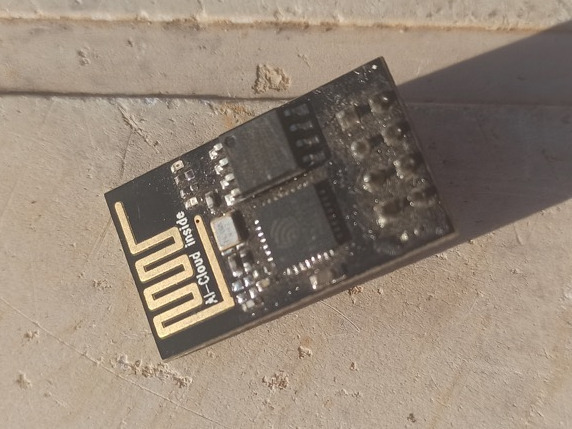

# aqua_man
## Introduction
I want to implement a system to messure the current waterlevel of a watertank with the help of a ultrasonic sensor. I want to integrate the sensor into the local home assistant network with the help of esphome.

## Initial Situation
There are to large watertanks with a total volume of 2000 liters installed half way up the mountain for a fresh water supply. From there we supply all the facilities of the FabFarm. The watertanks are connect to the waterpump thats installed in the valley of the farm. The waterpump is already integrated into the home assistant network through a relay thats connected to a microcontroller.

  
   
  

## Goal and Requirments

The goal is to monitor the waterlevel, transmit the data to the local home assistant server and implement an automation based on the datastream. Based on local circumstances and some research, I came up with the following requirments:

The System must
    1) include a self-sufficient energy supply
    2) communicate through WI-FI and Network with local home assistant server
    3) store excessiv energy
    4) work highly efficent
    5) withstand all weather conditions
    6) resistant to extreme heat and sun.

## Design

Based on the requirments I came up with the following compontants:

### ESP01

 

 The [ESP01 (Datasheet)](/datasheets/ESP01.PDF) is a type of low-cost Wi-Fi microcontroller module.  It is based on the ESP8266 chip and is small in size, making it a good choice for this project. Furthermore is works on 3.3 V and need only little power.

### Grove - Ultrasonic Ranger V2.0

 
 

 This [Sensor (Website)](https://wiki.seeedstudio.com/Grove-Ultrasonic_Ranger/) uses ultrasound to mesure the distance to an object or surface. Unlike the well known HC-SR04 sensor this one works with 3.3 V and trig and echo signal share 1 SIG pin. Therefore it can share the same power supply then the ESP.

- Operating Voltage: 3.2 ~ 4.2 V
- Operating Current: 8 mA
- Measuring range: 2 - 350 cm
- Resolution: 1 cm

### TP4056

 

Linear Li-Ion battery charger IC with a constant-current and constant-voltage charging algorithm, thermal regulation, and charge status indication.

## Resources
1) [ESP Home Custom Sensor Component](https://esphome.io/custom/custom_component.html)

## Tasks and Improments
- [ ] [Enable deep sleep on ESP01](https://www.instructables.com/Enable-DeepSleep-on-an-ESP8266-01/)
- [ ] [Remove LEDs from ESP](https://quadmeup.com/esp8266-esp-01-low-power-mode-run-it-for-months/)
- [ ] Remove battery indicator circuit. (Not working with GPIO 0 of ESP)
- [ ] Integrate heatmanagment for the hole system
- [ ] Dokumentation of Hardwaresetup
- [ ] Dokumentation of Softwaresetup